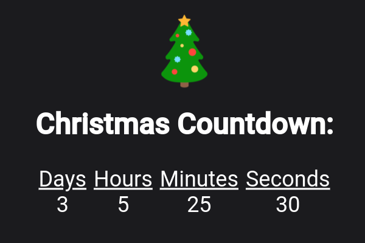

# christmas-countdown

Merry Christmas!

A quick little countdown I made for Christmas 2023.

[https://piplup7575.github.io/christmas-countdown](https://piplup7575.github.io/christmas-countdown)

You can change the date under the `script.js` file, by modifying the `countDownDate` variable.
The variable is organized by the following: `Month Day, Year Hour:Min:Sec`. For example, Christmas 2023 would be `Dec 25, 2023 00:00:00`

It pulls the time from your browser's local time, so it should automaticaly update depending on your time zone.

When the date and time is reached, the countdown is replaced with a message, sutch as `Merry Christmas!` This can be changed by editing `countdownMessage` variable.

Enjoy!
